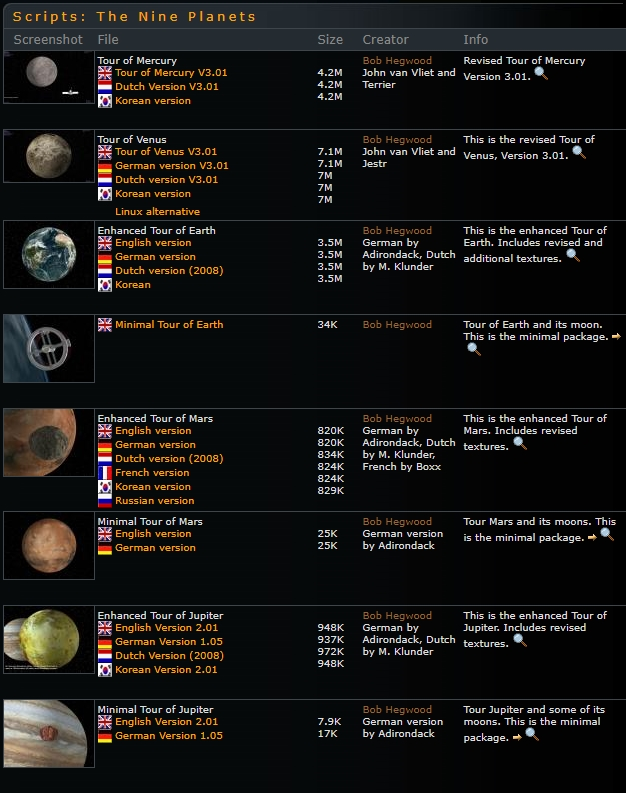
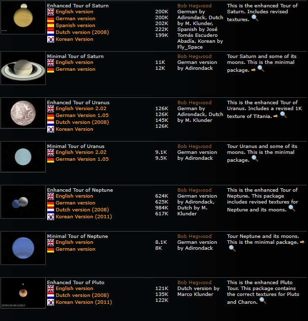
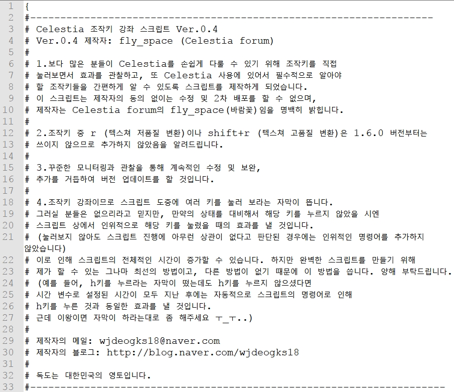

# Celestia(3D 천체 시뮬레이터)
<a href="https://celestia.space/download.html">Celestia 공식 사이트<a/><br>
이 프로그램은 제가 <b>중학교/고등학교</b> 때 잠깐 손을 대봤던 프로그램입니다. 제가 컴퓨터공학과에 진학하게 된 결정적 계기가 된 프로그램이며, 제 인생에 큰 터닝포인트가 된 프로그램이라 추가했습니다.<br>
주목할 만한 창작물이나 결과물은 없고 번역했던 스크립트/제가 만든 스크립트만 있으므로 대충 보고 넘어가셔도 됩니다.<br><br>

Celestia의 스크립트 종류로는 cel과 celx가 있으며, cel은 short-text based program이며 celx는 <a href="http://www.lua.org/">Lua</a> 언어와 Celestia 기반 API를 결합한 스크립트 언어 및 이로 이루어진 프로그램입니다.<br>
저는 당시 프로그램 언어에 대한 개념을 전혀 모르고 있었으며 직관적으로 읽고 해석이 가능했던 cel로 만들어진 스크립트들만 번역하고, 제작했습니다. 하지만 이러한 과정들을 통해 제가 만든 스크립트가 Celestia에서 작동되고, 다른 사람들이 이를 사용한다는 것에 큰 매력을 느꼈습니다. 어쩌면 이런 일들을 하면서 컴퓨터공학과로 진학하겠다는 마음이 들었을지도 모르겠습니다. Celestia가 절 컴퓨터공학과로 진학하게 만든 것은 사실이니까요.<br>
스크립트 번역이나 제작은 대학교 진학 이후 그만두었지만 언제든지 다시 시작할 수 있습니다. 그때쯤이면 celx 스크립트도 분석하고 번역 및 제작할 수 있겠죠.<br><br>

이 Repository의 구성은 다음과 같습니다
```
1. Translated Script
: Celestia 애드온 사이트인 Celestia Motherlode(www.celestiamotherlode.net)에 등재되어 있는 스크립트들을 번역한 것입니다. 태양계 행성(퇴출된 명왕성 포함) 탐사 스크립트들과, Cassini Mission 관련 스크립트를 번역했습니다.

2. Control Key of Celestia
: Celestia를 처음 접하시는 분들을 위한 간단한 조작키 안내 스크립트입니다.
```

----
## The Nine Planets + Other
수성에서부터 지금은 퇴출된 명왕성까지 총 9개의 행성을 각각 탐방하는 스크립트와,<br>
목성 탐사를 목적으로 발사된 우주 탐사선 카시니 호에 대한 스크립트를 번역했습니다.<br>




<br><br>
## Control Key of Celestia
Celestia를 사용할 때 사용법에 대한 전반적인 내용을 담은 스크립트입니다.<br>
지금은 한글화가 되어 있어서 이용에 그렇게 큰 무리는 없지만 키보드를 이용한 조작을 하고 싶으신<br>
분들에게 도움을 드리고자 만들게 되었습니다. 제작 당시 Celestia 사용자들의 설문 조사를 통해<br>
설명이 필요한 조작키를 모아 만들었으며 현재 최신 버전은 0.41입니다.<br>
